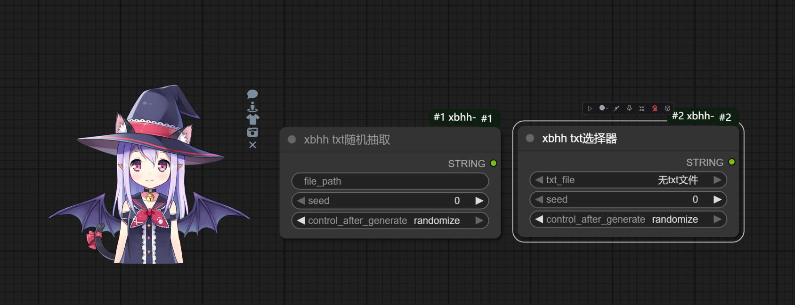
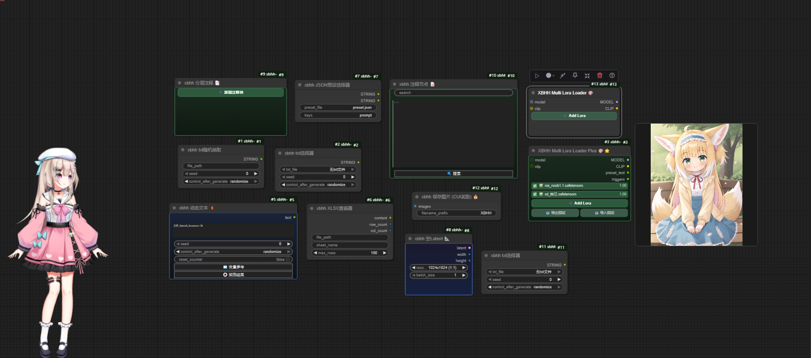

# XBHH ComfyUI 套件 🎨

**XBHH ComfyUI Kit** 是一套功能丰富、设计精美的 ComfyUI 自定义节点和扩展插件集合。它不仅提供了高效的 LoRA 管理工具，还集成了可交互的 Live2D 桌面看板娘。

---

## ✨ 核心功能

### 🎭 Live2D 桌面看板娘 (Live2D Pet)

直接在 ComfyUI 工作流界面中召唤你的纸面老婆/老公！

- **多引擎支持**: 兼容 Live2D V2 (SDK 2.1) 和 V5 (Cubism 4/5) 模型。
- **动态交互**: 支持鼠标追踪、点击对话、随机动作及表情切换。
- **换装系统**: 支持 V2 模型的一键快速换装（贴图切换）。
- **右键菜单**: 便捷切换模型、调整缩放比例、设置灵敏度或暂时隐藏。
- **自动扫描**: 自动识别 `web/live2d` 目录下的所有模型文件。

> [!TIP]
> 关于如何添加自己的 Live2D 模型，请参考：[Live2D 模型管理指南](./LIVE2D_GUIDE.md)



---

### 🎨 LoRA 高级管理

| 节点                               | 功能说明                                                            |
| ---------------------------------- | ------------------------------------------------------------------- |
| **XBHH Multi Lora Loader 🎨**      | 支持点击动态增加 LoRA 槽位，支持树形文件夹选择。                    |
| **XBHH Multi Lora Loader Plus 🚀** | 在基础版上增加了 **预设导入/导出** 功能，支持保存常用的 LoRA 组合。 |
| **LoRA 预览增强**                  | 当鼠标悬停在列表或已选 LoRA 上时，实时显示预览图。                  |



---

### ⚡ 效率工具与文本处理

- **xbhh 动态文本 ⚡**: 支持使用 `%date%`, `%counter%`, `%random%` 等变量进行动态文本替换。
- **xbhh XLSX 查看器**: 无需打开 Excel，直接在 ComfyUI 内预览 `.xlsx` 文件内容。
- **xbhh 空Latent 📐**: 提供 15+ 种常用比例预设，自动对齐 8 倍数。
- **xbhh 注释节点**: 带有层级感和搜索高亮功能的笔记节点，让工作流更清晰。
- **xbhh txt 随机抽取**: 从特定的文本库中随机挑选提示词关键词。

---

## 📦 安装与配置

### 1. 使用 ComfyUI Manager (推荐)

- 搜索 `xbhh-lora` 并点击安装。

### 2. 手动安装

```bash
cd ComfyUI/custom_nodes
git clone https://github.com/xbhh123456/Comfyui-xbhh-main.git
cd Comfyui-xbhh-main
pip install -r requirements.txt
```

### 3. 配置 Live2D 模型

将你的 Live2D 模型文件夹放入 `web/live2d/` 目录下即可自动识别。详细路径结构请查看 [LIVE2D_GUIDE.md](./LIVE2D_GUIDE.md)。

---

## 📅 路线图

- [x] Live2D V2/V5 引擎集成
- [x] 多 LoRA 预览与管理
- [ ] 更多 Live2D 交互动作（如语音同步）
- [ ] 增加更多实用的图像处理节点

---

## 📄 许可证

本项目采用 **MIT License**。

## 🙏 致谢

- Live2D 核心库及相关开源实现。
- [rgthree-comfy](https://github.com/rgthree/rgthree-comfy) 的 UI 设计理念。
- [ComfyUI](https://github.com/comfyanonymous/ComfyUI) 官方团队。

---

_如果你喜欢这个项目，欢迎点个 Star 🌟！_
